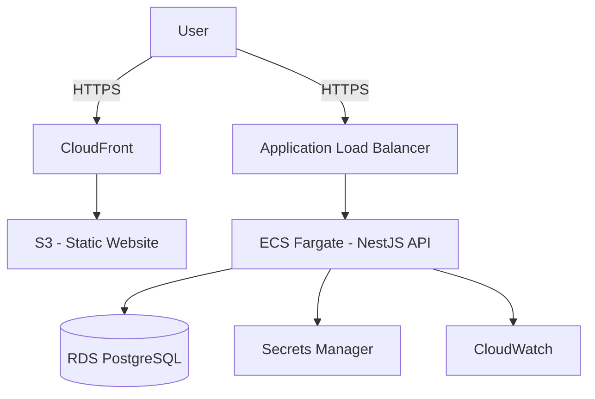

## Teddy Monorepo (Turbo + pnpm)

Monorepo contendo:
- `packages/core`: Tipagens e utilitários compartilhados (TypeScript)
- `apps/server`: API em NestJS + TypeORM + Postgres
- `apps/website`: Front-end React + Vite

### Requisitos atendidos
- Monorepo com Turborepo e pnpm
- TypeScript em todos os pacotes
- React + Vite no front-end
- Nest.js + TypeORM + Postgres no back-end
- Arquitetura pensada para AWS

### Como rodar (dev)
1. Instale dependências:
   ```bash
   pnpm install
   ```
2. Configure as variáveis de ambiente:
   - Copie `apps/server/env.example` para `apps/server/.env`
   - Copie `apps/website/env.example` para `apps/website/.env`
3. Em desenvolvimento (rodando tudo em paralelo):
   ```bash
   pnpm dev
   ```
   - Website em `http://localhost:5173`
   - API em `http://localhost:3000`

### Docker (dev)
Suba todas as aplicações (db + api + website) com hot-reload:
```bash
docker compose up --build
```
- Website: `http://localhost:5173`
- API: `http://localhost:3000`
- Swagger: `http://localhost:3000/docs`

### Estrutura
```
.
├── apps
│   ├── server      # NestJS API (TypeORM + Postgres)
│   └── website     # React + Vite
├── packages
│   └── core        # Tipos compartilhados
├── docker-compose.yml
├── turbo.json
├── pnpm-workspace.yaml
└── tsconfig.base.json
```

### Arquitetura proposta (AWS)
- Website (SPA React) hospedado em S3 com distribuição CloudFront
- API NestJS conteinerizada rodando em ECS Fargate atrás de um ALB
- Banco de dados gerenciado (Amazon RDS for PostgreSQL)
- Segredos/credenciais no AWS Secrets Manager
- Observabilidade com CloudWatch (logs, métricas, alarmes) e X-Ray (opcional)
- Imagens no ECR, CI/CD via GitHub Actions → ECR/ECS deploy
- VPC com subnets públicas/privadas; RDS em subnets privadas; NAT Gateway para tráfego de saída



### Padrões e decisões
- NestJS seguindo convenções oficiais (módulos, providers, DTOs, validação)
- TypeORM `synchronize=true` somente em dev (migrations para produção)
- Tipos compartilhados pelo pacote `@teddy/core`
- Turborepo orquestra `dev`, `build`, `lint`, `test`

### Swagger
- A documentação da API está disponível em `http://localhost:3000/docs` quando a API está rodando.

### Deploy (produção com Docker Compose)
Build e execute os serviços em modo produção:
```bash
docker compose -f docker-compose.prod.yml up --build -d
```
- Website: `http://localhost:8080`
- API: `http://localhost:3000`
- Postgres: porta `5432` (exposta localmente)

### Perguntas (Painel administrativo)
1. Quanto tempo levaria?
   - Resposta: De 2 a 3 semanas para um MVP sólido, com autenticação básica, CRUD completo de clientes, filtros e paginação, layout responsivo, testes básicos (e2e e unitários) e deploy CI/CD.
2. Quantos desenvolvedores?
   - Resposta: 2 a 3 desenvolvedores.
3. Qual a senioridade dos desenvolvedores?
   - Resposta: 1 Tech Lead/Senior (arquitetura, back-end e CI/CD), 1 Pleno (front-end principal), 1 Júnior/Pleno (apoio full-stack e testes). Em um time de 2, um Senior + um Pleno.

### Scripts úteis
```bash
pnpm dev      # roda website e server em paralelo
pnpm build    # build de todos os pacotes
pnpm lint     # lint (se configurado nos pacotes)
pnpm test     # testes (se configurados nos pacotes)
```

### Produção (resumo)
- Build do website → deploy S3 + invalidação no CloudFront
- Build da API → imagem no ECR → deploy ECS Fargate
- Variáveis sensíveis via Secrets Manager; conexão ao RDS via security groups e IAM roles

---
Este projeto foi preparado como base para o teste Tech-Lead Teddy.
